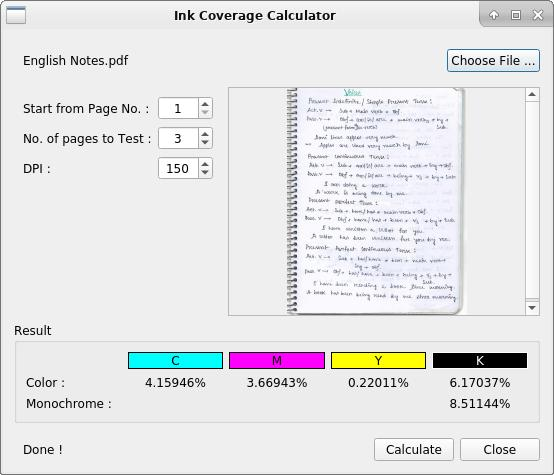

# Ink Coverage Calculator

Calculate ink coverage for printing in grayscale

**Runtime Dependency**  
* libqt5core5a, libqt5gui5  
* libpoppler-qt5-1  

**Build Dependency**  
* qtbase5-dev  
* libpoppler-qt5-dev  

### Build and Install
To build, install dependencies and run following commands...  
    `qmake`  
    `make -j4`

To install it in Linux, run...  
    `sudo make install`  
It will be installed in /usr/local/bin

### Usage
To run after installing, type command..  
  `ink_coverage`  
Or  
  `ink_coverage file.pdf`  

### Screenshot

  

